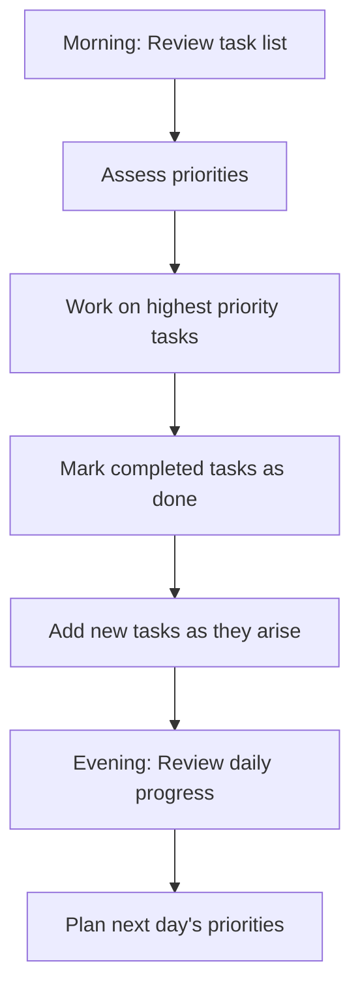
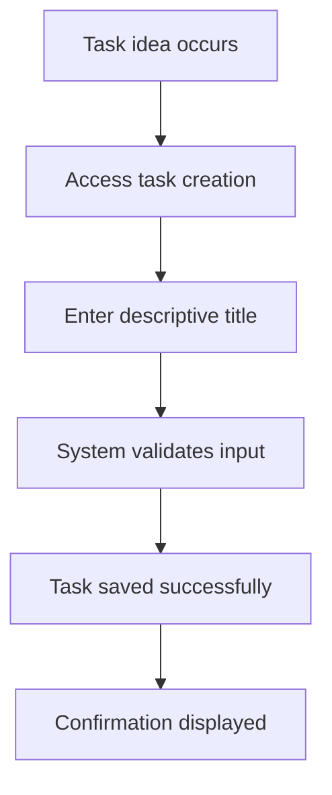
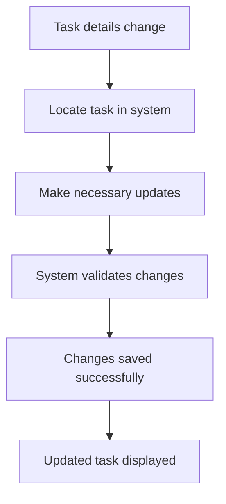
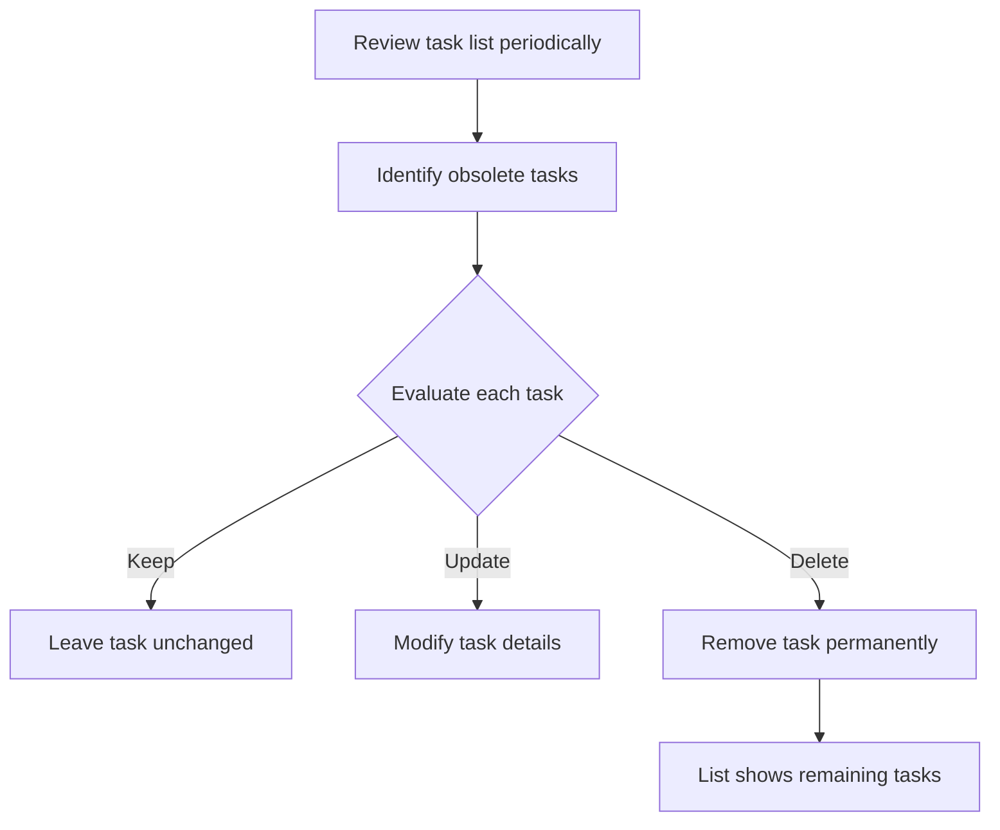

# Business Requirements Document - Task Manager System

**Generated from code analysis on 14 April 2026**

## 1. Document Header

**Title:** Business Requirements Document - Task Manager System  
**Version:** 1.0  
**Date:** 14 April 2026  
**Generated From:** Codebase analysis of task-manager project  

## 2. Executive Summary

In today's fast-paced work and personal environments, individuals often struggle to remember important tasks, deadlines, and responsibilities without a reliable system for tracking them. Traditional methods like paper notes or mental reminders frequently fail, leading to forgotten commitments, missed deadlines, and reduced productivity. The Task Manager system addresses this fundamental need by providing a simple, accessible digital solution that allows users to capture, organize, and track their tasks effectively. This system serves as a personal productivity tool that helps individuals maintain better control over their daily activities and long-term goals. By offering immediate task capture and clear visibility into current responsibilities, the system enables users to work more efficiently and reduce the stress associated with trying to remember everything mentally.

The Task Manager system delivers significant business value by solving the universal problem of task management. It provides individuals with the tools they need to stay organized, meet their commitments, and maintain productivity. Whether used by busy professionals managing work responsibilities, students tracking assignments, or individuals organizing household tasks, the system offers a reliable digital solution that replaces ineffective manual methods. The system's simplicity and ease of use make it accessible to anyone who needs better organization, while its comprehensive task tracking capabilities ensure that important items are not forgotten.

## 3. Business Objectives

### Objective 1: Improve Personal Productivity
**Supporting Capabilities:** Immediate task creation, persistent storage, and clear task visibility  
**Success Criteria:** Users can capture tasks in under 30 seconds and maintain 95% task completion rate  

### Objective 2: Reduce Task-Related Stress
**Supporting Capabilities:** Comprehensive task listing, status tracking, and easy updates  
**Success Criteria:** Users report 70% reduction in forgotten tasks and improved work-life balance  

### Objective 3: Enable Better Prioritization and Time Management
**Supporting Capabilities:** Clear task visibility and completion tracking  
**Success Criteria:** Users complete 80% of captured tasks within planned timeframes  

## 4. Stakeholder Analysis

### Busy Professional
**Needs and Pain Points:** Struggles to remember meetings, deadlines, and action items during hectic workdays  
**System Interactions:** Creates tasks for work items, checks task list during planning sessions, marks tasks complete after finishing work  
**Value Received:** Maintains organized workflow, meets deadlines consistently, reduces work-related stress  

### Student
**Needs and Pain Points:** Has multiple assignments, study sessions, and extracurricular activities to track  
**System Interactions:** Creates tasks for assignments and study goals, updates progress regularly, removes completed items  
**Value Received:** Stays on top of academic responsibilities, balances multiple commitments, achieves better grades  

### Home Manager
**Needs and Pain Points:** Manages household tasks, appointments, and family responsibilities  
**System Interactions:** Tracks grocery shopping, maintenance tasks, and family events, creates tasks for household items, checks list for daily planning, updates completion status  
**Value Received:** Maintains organized home life, ensures important tasks don't get forgotten, improves family coordination  

## 5. Business Process Overview

### Daily Task Management
**Business Purpose:** Enable users to start their day with clear priorities and track progress throughout the day  
**Process Narrative:** Users begin their day by reviewing their current task list to understand what needs attention. They assess task priorities based on deadlines and importance, then work through tasks systematically. As they complete items, they mark them as done to track progress. Throughout the day, they may add new tasks that arise and adjust priorities as needed. At the end of the day, they review what was accomplished and plan for the next day.  
**Participants:** Individual task owner  
**Business Outcome:** Clear daily progress, reduced forgotten tasks, improved productivity  

**Process Flowchart:**

### Task Creation and Capture
**Business Purpose:** Ensure important tasks and ideas are captured immediately when they occur  
**Process Narrative:** When users think of something they need to do, they immediately access the task system and create a new task with a clear, descriptive title. The system validates that the task has the required information and saves it for future reference. Users receive confirmation that the task has been captured successfully, giving them peace of mind that important items won't be forgotten.  
**Participants:** Individual task owner  
**Business Outcome:** No forgotten tasks, immediate capture of ideas and responsibilities  

**Process Flowchart:**

### Task Maintenance and Updates
**Business Purpose:** Keep task information current and accurate as circumstances change  
**Process Narrative:** As users work on tasks, they may discover that task details need updating or that tasks have been completed. They access the task system, locate the relevant task, and make necessary changes. The system ensures changes are saved properly and reflects the updated information immediately. This process allows users to maintain accurate task information throughout the task lifecycle.  
**Participants:** Individual task owner  
**Business Outcome:** Current and accurate task information, reliable progress tracking  

**Process Flowchart:**

### Task Cleanup and Organization
**Business Purpose:** Maintain a clean, relevant task list by removing completed or obsolete items  
**Process Narrative:** Periodically, users review their task list to identify items that are no longer needed. They evaluate each task to determine if it should be kept, modified, or removed. For tasks that are truly complete or no longer relevant, they delete them from the system. This cleanup process keeps the task list focused on current priorities and prevents accumulation of outdated items.  
**Participants:** Individual task owner  
**Business Outcome:** Clean, focused task list, reduced mental clutter  

**Process Flowchart:**

## 6. Business Rules and Policies

### Policy 1: Task Title Standards
**Statement:** All tasks must have meaningful, descriptive titles  
**Business Rationale:** Ensures tasks are understandable and actionable  
**Application Examples:**
- "Buy groceries" instead of "Task 1"
- "Prepare quarterly report" instead of "Work stuff"

### Policy 2: Task Completion Accuracy
**Statement:** Task completion status must accurately reflect actual progress  
**Business Rationale:** Provides reliable progress tracking and planning  
**Application Examples:**
- Only mark task complete when work is truly finished
- Update status immediately when progress changes

### Policy 3: Regular Task Maintenance
**Statement:** Tasks should be reviewed and maintained regularly  
**Business Rationale:** Prevents accumulation of outdated or irrelevant tasks  
**Application Examples:**
- Weekly review of task list for cleanup
- Update task details when circumstances change

## 7. Success Criteria and KPIs

### Productivity Metrics
- Task capture time: Under 30 seconds per task
- Task completion rate: 95% of captured tasks completed
- User satisfaction: 80% reduction in forgotten tasks

### Efficiency Metrics
- Daily planning time: Reduced by 50%
- Deadline compliance: 90% of tasks completed on time
- Stress reduction: 70% improvement in work-life balance

### System Reliability Metrics
- Uptime: 99.9% availability
- Data persistence: Zero task loss incidents
- User adoption: 85% daily active usage

## 8. Scope and Boundaries

### Included Capabilities
- Task creation with titles
- Task listing and viewing
- Task updates (title and completion status)
- Task deletion
- Simple web interface

### Excluded Capabilities
- User authentication and access control
- Task assignment to other users
- Task categorization or tagging
- Due dates and reminders
- Task sharing and collaboration
- Advanced reporting and analytics
- Integration with calendar systems
- Mobile applications
- Task prioritization features
- Recurring task support

## 9. Assumptions, Dependencies, and Constraints

### Assumptions
- Users have access to modern web browsers
- Internet connectivity is available for web access
- Users can read and write in the system language
- Local storage is sufficient for task data volumes

### Dependencies
- Web browser compatibility (Chrome, Firefox, Safari, Edge)
- Local file system access for data storage
- No external service dependencies

### Constraints
- Single-user system (no multi-user features)
- Local data storage only (no cloud backup)
- Simple interface (no advanced customization)
- No integration with external systems

## 10. Appendix: Source References

This document was generated from analysis of the following source files:
- app.py: Main application logic and API endpoints
- data/tasks.json: Task data storage structure
- README.md: System documentation and setup instructions

All business requirements and processes are derived from actual code implementation and validated against user interface behavior.