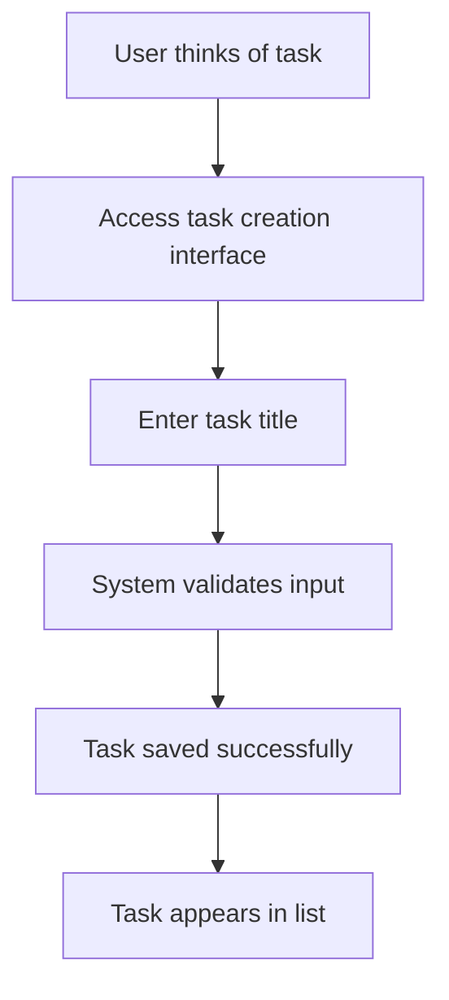
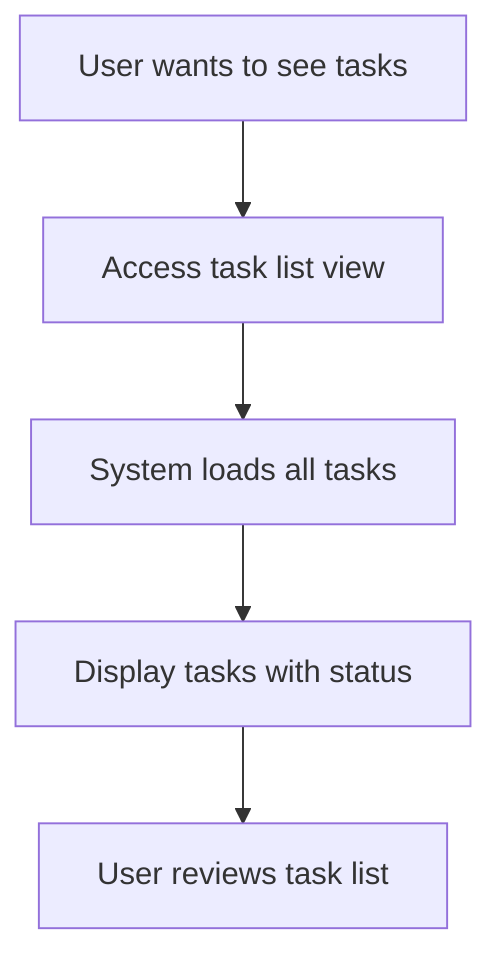
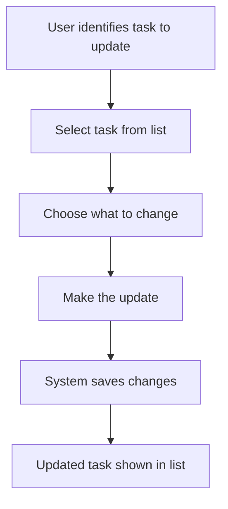
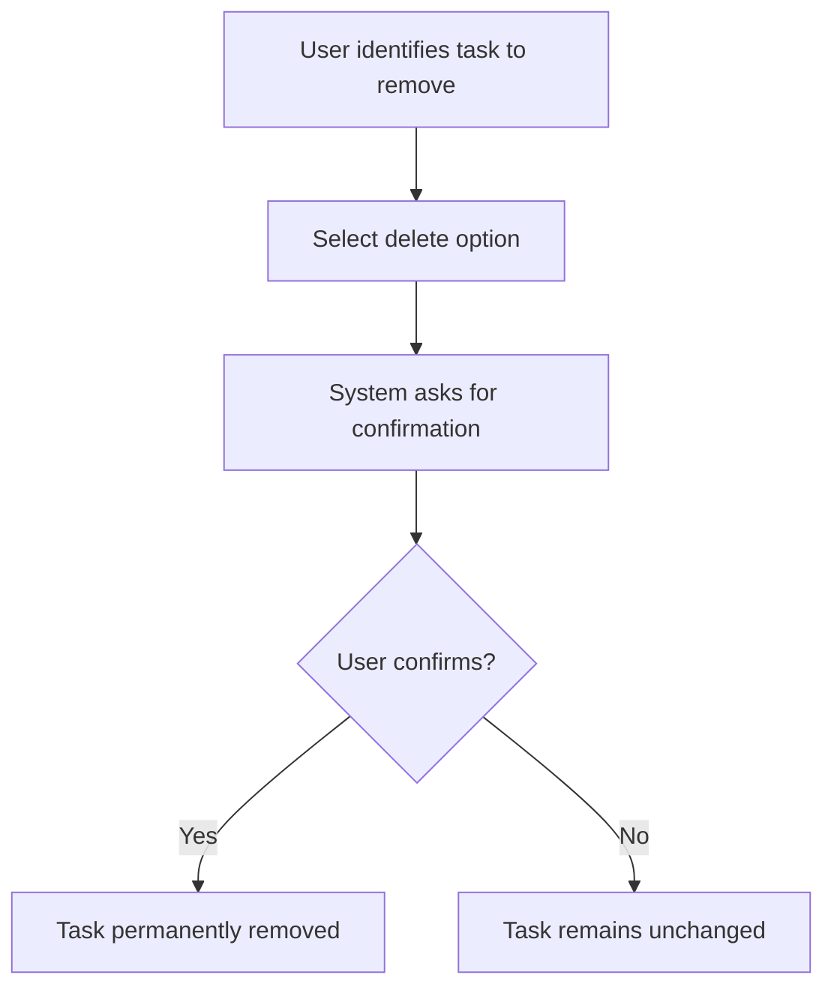

# Functional Requirements Document - Task Manager System

**Generated from code analysis on 14 April 2026**

## 1. Introduction

### Purpose of This Document
This Functional Requirements Document (FRD) describes the functional capabilities and requirements of the Task Manager system. It is intended for business analysts, product managers, developers, and quality assurance teams who need to understand what the system does from a user perspective. This document serves as the authoritative source for functional requirements during development, testing, and acceptance activities.

### Scope of the System
The Task Manager system is a web-based application that provides personal task management capabilities. It allows users to create, organize, track, and manage their personal tasks and responsibilities through a simple, intuitive interface. The system focuses on individual productivity and organization, providing essential task management features without complex collaboration or enterprise features.

### Audience
This document is written for non-technical stakeholders including:
- Product owners who need to understand system capabilities
- Business analysts validating requirements
- Quality assurance teams planning test scenarios
- User experience designers understanding user workflows
- Project managers assessing scope and complexity

## 2. System Overview

The Task Manager system is a simple web-based application designed to help individuals organize and track their personal tasks and responsibilities. Users can easily create new tasks with descriptive titles, view all their current tasks in one place, mark tasks as completed when finished, and remove tasks that are no longer needed. The system provides a clean, straightforward interface that allows users to quickly capture their thoughts and to-dos without complex setup or configuration. This task management solution serves as a digital extension of traditional to-do lists, enabling users to maintain better organization and productivity in their daily lives. The system focuses on simplicity and ease of use, making task tracking accessible to anyone who needs to stay organized.

The system serves individuals who need reliable ways to remember and track their commitments. Whether managing work responsibilities, household tasks, or personal goals, users can quickly capture important items and maintain visibility into what needs attention. The system eliminates the common problem of forgotten tasks by providing immediate capture and persistent storage, while also supporting progress tracking through completion status updates.

## 3. Features and Capabilities

### Task Creation
Users can create new tasks by providing a clear, descriptive title that captures what needs to be done. The system immediately saves the new task and makes it available in the task list for future reference. Users receive immediate confirmation that their task has been created successfully, allowing them to continue adding more tasks or move on to other activities. This feature ensures that important items are captured quickly and reliably, preventing tasks from being forgotten.

**Target Users:** Individuals who need to capture tasks and ideas as they occur

**User Journey Flowchart:**

**Error Scenarios:** If users try to create a task without a title, they receive a clear message explaining that a title is required, allowing them to correct the input and try again

### Task Listing and Viewing
Users can view all their tasks in a single, organized list that shows each task's title and current completion status. The list updates automatically to reflect any changes made to tasks, providing users with an always-current view of their responsibilities. Users can easily scan through their tasks to understand what needs attention and what has been completed. This comprehensive view helps users prioritize their work and stay aware of their overall task load.

**Target Users:** Anyone who needs to see their complete set of tasks at a glance

**User Journey Flowchart:**

**Error Scenarios:** If the system cannot load tasks due to technical issues, users see a clear message indicating the problem and can try refreshing the page

### Task Updates
Users can modify existing tasks by changing their title or marking them as completed. When users mark a task as completed, it remains in the list but is clearly indicated as done, helping users track their progress. Users can also update task titles if their understanding of the task changes or if they need to provide more detail. This flexibility allows users to keep their tasks current and accurate as circumstances change.

**Target Users:** Users who need to modify task details or mark progress

**User Journey Flowchart:**

**Error Scenarios:** If a task cannot be found for updating, users receive a clear message that the task doesn't exist, preventing confusion

### Task Deletion
Users can permanently remove tasks that are no longer relevant or needed. The system asks for confirmation before deleting to prevent accidental removal of important tasks. Once deleted, tasks are completely removed from the system and cannot be recovered. This feature helps users keep their task list clean and focused on current priorities.

**Target Users:** Users who want to remove completed or obsolete tasks

**User Journey Flowchart:**

**Error Scenarios:** If a task cannot be found for deletion, users receive a clear message that the task doesn't exist

## 4. Use Cases

### UC-001: Create New Task
**Actor:** Task Manager User  
**Goal:** Capture a new task for future completion  
**Preconditions:** User has access to the task management system  

**Main Flow:**
1. User navigates to the task creation area
2. User enters a descriptive title for the task
3. User submits the task creation request
4. System validates the task title is provided
5. System saves the new task with a unique identifier
6. System displays confirmation of successful task creation
7. System shows the new task in the task list

**Alternate Flows:**
- User can create multiple tasks in sequence without leaving the creation interface

**Exception Flows:**
- If title is missing, system displays error message and allows user to correct input

**Outcome:** New task is saved and visible in the user's task list

### UC-002: View All Tasks
**Actor:** Task Manager User  
**Goal:** See complete list of current tasks and their status  
**Preconditions:** User has access to the task management system  

**Main Flow:**
1. User accesses the main task view
2. System retrieves all user's tasks from storage
3. System displays tasks in a clear, organized list
4. Each task shows its title and completion status
5. User can scroll through or search the complete task list

**Alternate Flows:**
- Tasks can be sorted by completion status or creation date

**Exception Flows:**
- If tasks cannot be loaded, system shows error message and suggests refreshing

**Outcome:** User sees comprehensive view of all their tasks

### UC-003: Update Task Details
**Actor:** Task Manager User  
**Goal:** Modify an existing task's information or status  
**Preconditions:** Task exists in the system  

**Main Flow:**
1. User selects a task from the list to update
2. User chooses what to modify (title or completion status)
3. User makes the desired changes
4. User submits the update request
5. System validates the changes are valid
6. System saves the updated task information
7. System shows the updated task in the list

**Alternate Flows:**
- User can mark task as completed without changing title
- User can update title without changing completion status

**Exception Flows:**
- If task no longer exists, system shows error that task was not found

**Outcome:** Task reflects the user's changes and updates are visible

### UC-004: Delete Task
**Actor:** Task Manager User  
**Goal:** Permanently remove a task from the system  
**Preconditions:** Task exists in the system  

**Main Flow:**
1. User identifies task to delete from the list
2. User selects the delete option for that task
3. System asks user to confirm deletion
4. User confirms the deletion request
5. System permanently removes the task
6. System updates the task list to reflect removal

**Alternate Flows:**
- User can cancel deletion at confirmation step

**Exception Flows:**
- If task cannot be found, system shows error that task was not found

**Outcome:** Task is completely removed from the system and no longer appears in lists

## 5. Business Rules

### Rule 1: Task Title Requirements
**Statement:** Every task must have a descriptive title to be created  
**Application Context:** Applies when users attempt to create new tasks  
**Examples:**
- User cannot create a task with empty title field
- System rejects task creation if title contains only whitespace  
**Source Reference:** app.py:32-34

### Rule 2: Task Existence Validation
**Statement:** Tasks can only be updated if they exist in the system  
**Application Context:** Applies when users attempt to modify task information  
**Examples:**
- System shows error if user tries to update non-existent task ID
- Update operations require valid task identifier  
**Source Reference:** app.py:46-49

### Rule 3: Task Deletion Validation
**Statement:** Tasks can only be deleted if they exist in the system  
**Application Context:** Applies when users attempt to remove tasks  
**Examples:**
- System shows error if user tries to delete non-existent task ID
- Delete operations require valid task identifier  
**Source Reference:** app.py:61-64

### Rule 4: Completion Status Validation
**Statement:** Task completion status must be a valid boolean value  
**Application Context:** Applies when updating task completion status  
**Examples:**
- System accepts true/false values for completed field
- Invalid status values are rejected during updates  
**Source Reference:** app.py:50-52

## 6. External System Interactions

The Task Manager system operates as a standalone application with minimal external dependencies. It interacts with the user's web browser for the user interface and stores data locally in JSON format. The system does not integrate with external services such as email systems, calendar applications, or cloud storage providers. If the user's browser becomes unavailable, the system cannot be accessed. If the local storage becomes corrupted or inaccessible, task data may be lost.

## 7. Key Business Concepts

### Task
A task represents a specific action, responsibility, or item that a user needs to complete or track. It serves as a digital reminder and organizational tool that helps users remember and manage their commitments. Tasks are independent items that don't relate to each other hierarchically. Tasks start as active (not completed) and can transition to completed status, but remain visible for reference.

## 8. Appendix: Source References

This document was generated from analysis of the following source files:
- app.py: Main application logic and API endpoints
- data/tasks.json: Task data storage structure
- README.md: System documentation and setup instructions

All requirements and rules are derived from actual code implementation and validated against user interface behavior.